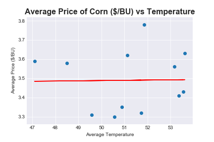
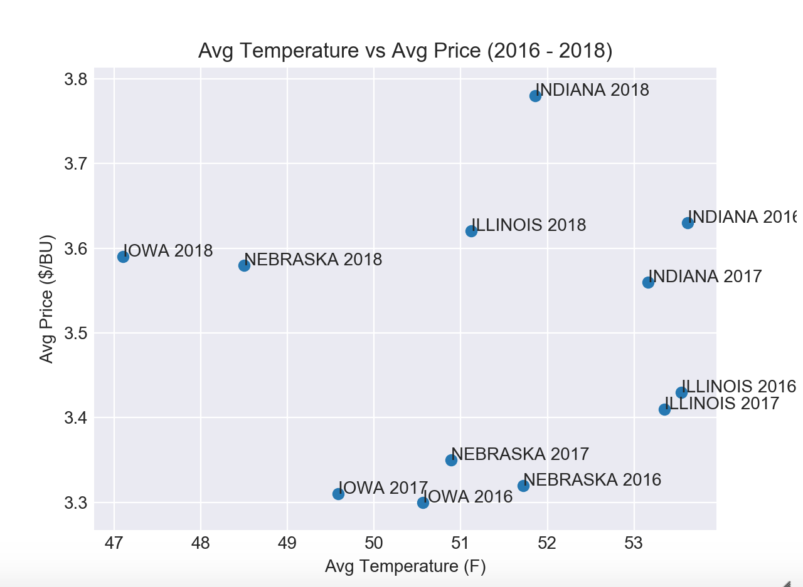
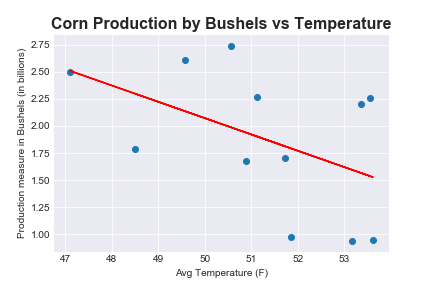
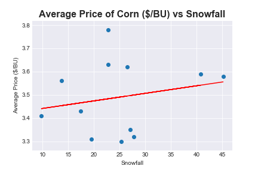
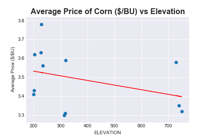
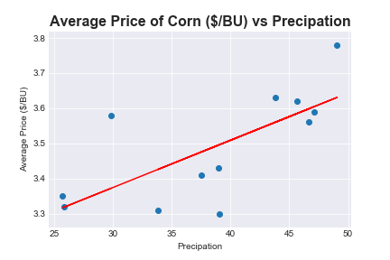
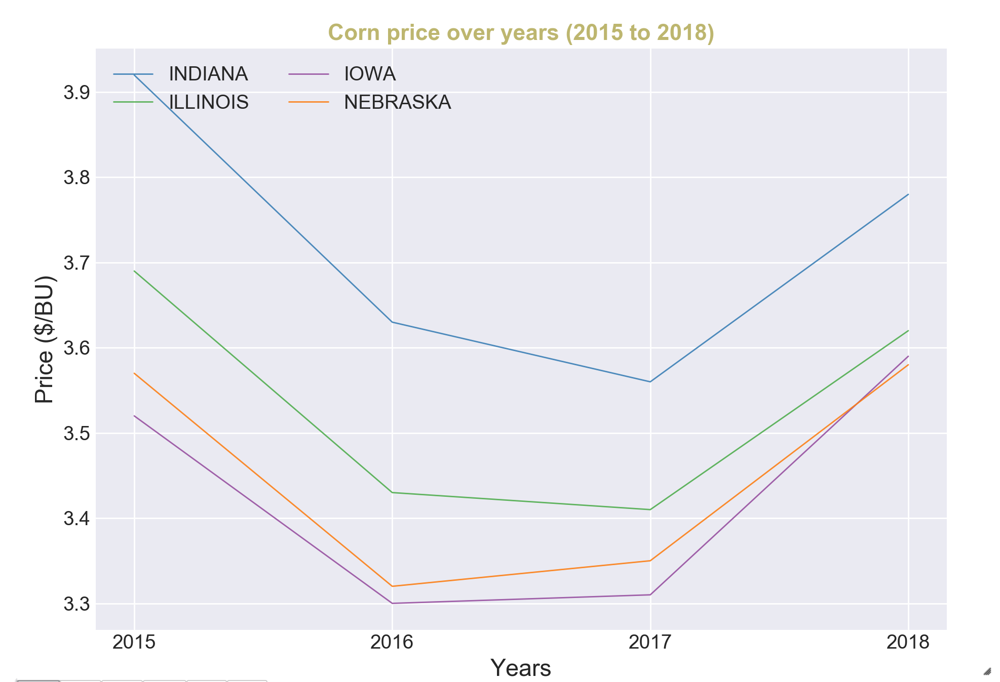

# Project-1: Corn vs Weather

## Scope

Our project examines how weather impacts corn prices (US territory).

We will examine:

* _whether temperature affects corn prices_
* _what weather type has the largest impact (positive price and negative price)_
* _what weather type has the least impact on prices_

To elaborate on our questions, we needed to focus on the heartland of corn, the Midwest.  We chose the 4 top states of corn production in the US to compare weather to corn prices:  Iowa, Indiana, Illinois, and Nebraska.  We will also see if:

* _there are differences between the prices they receive for the corn that they produce_
* _whether the weather in one area affect the corn price in another_

## APIs/Datasets

We will use the following APIs:

* _NOAA National Centers for Environmental Information (https://www.ncdc.noaa.gov/cdo-web/datasets)_ 
* _USDA - United Stated Department of Agriculture API (https://quickstats.nass.usda.gov/api)_ 

## Files to review:

* _Corn-prices.ipynb_

* _Corn_master.ipynb_
* _joecorn.ipynb_

## Findings

The main focus for our data we were looking for was temperatures in those states, corn prices, and corn productions.

### _Temperature vs. Corn Prices_

Our first hypothesis was that temperature had a significant impact on corn prices.  After reviewing the data, we found that there was little correlation between the two.

Between states, there were no differences either.  

### _Temperature vs. Corn Production_

When we looked at Corn Production (in terms of bushels produced), we did see a moderate correlation with temperature.  The colder the temperature the more corn production there was.

### _Other Weather Conditions v. Corn Prices_

We also examined other factors such as snowfall, precipitation and elevation to see their affects on price.  What we found was that snowfall and elevation had little correlation with corn prices.

Our data showed that precipitation had the greatest impact on corn prices.  The r value was 0.709.

### _States vs. Price_

There were no differences between the states.  The growth and decline were relatively the same.

## Conclusions

In order to form more valid conclusions, more data needs to be collected and analyzed.  If we expand to more states what will we see.  If we look at a five or ten year period would that change our outcomes?  More analysis is needed.

